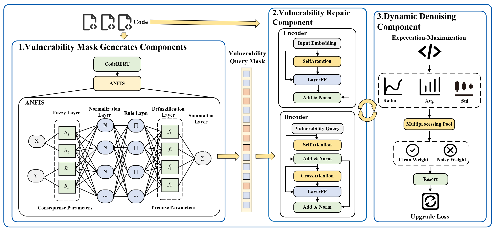

<div style="text-align: center;">
    <h1>Automated Vulnerability Repair with Noise-Robust Learning <br> (Reproduction of Experiments)</h1>
    
</div>

<p align="center">
  </a>
  <h3 align="center">NRLearn</h3>
  <p align="center">
    Automated Vulnerability Repair with Noise-Robust Learning
  </p>
</p>

Software vulnerabilities refer to security flaws, faults, or weaknesses found in software code, which may lead to serious system crashes or serve as sources of threats for attackers (CSRC, 2020).
Current automated vulnerability repair methods still need to address the complexity of vulnerability root causes and the issue of noisy datasets. To address these limitations, this paper proposes an NRLearn method with three components: vulnerability mask generate components, vulnerability repair part, and dynamic denoising component. In the Vulnerability Mask Generate Components, the process starts by utilizing the CodeBert model to learn vulnerability labels, followed by using an Adaptive Neuro-Fuzzy Inference System based on fuzzy if-then rules to infer and model Vulnerability Masks. By applying vulnerability masks(VMs) to the self-attention mechanism of the repair encoder, the encoding is focused more on vulnerable areas. Moreover, VMs are also applied in the multi-head attention of the vulnerability repair decoder to reinforce Vulnerability Queries. The encoder in the vulnerability repair component utilizes self-attention layers and feed-forward neural networks to encode the embedded sequence, while the decoder uses Vulnerability Queries to match and capture vulnerability code token information. The dynamic denoising component redefines the training loss by constructing a distribution-aware confidence function, assigning higher weights to clean data, thereby improving the recognition of vulnerable code tokens and enhancing the training efficiency of generating corresponding repair patch pairs.
     
## Table of contents

<!-- Table of contents -->
<details open="open">
  <summary></summary>
  <ol>
    <li>
      <a href="#how-to-reproduce">How to reproduce</a>
        <ul>
          <li><a href="#environment-setup">Environment Setup</a></li>
          <li><a href="#reproduction-of-experiments">Reproduction of Experiments</a></li>
        </ul>
    </li>
    <li>
      <a href="#license">License</a>
    </li>
    <li>
      <a href="#citation">Citation</a>
    </li>
  </ol>
</details>

## How to reproduce 

### Environment Setup
<details open="open">
  <summary></summary>
  
First of all, clone this repository to your local machine and access the main dir via the following command:
```
git clone https://github.com/awsm-research/VQM.git
cd NRLearn
```

Then, install the python dependencies via the following command:
```
pip install -r requirements.txt
cd NRLearn/transformers
pip install .
cd ../..
```

* We highly recommend you check out this <a href="https://pytorch.org/">installation guide</a> for the "torch" library so you can install the appropriate version on your device.
  
* To utilize GPU (optional), you also need to install the CUDA library, you may want to check out this <a href="https://docs.nvidia.com/cuda/cuda-quick-start-guide/index.html">installation guide</a>.
  
* <a href="https://www.python.org/downloads/release/python-397/">Python 3.9.7</a> is recommended, which has been fully tested without issues.
 
</details>
 
### Reproduction of Experiments
  
  <details open="open">
    <summary></summary>
    
  Download necessary data and unzip via the following command: 
  ```
  cd data
  sh download_data.sh 
  cd ..
  ```
  
  </details>  
  
  <details open="open">
    <summary></summary>
  
  #### Reproduce Section 4 - RQ1
  - NRLearn (proposed approach)
    * Retrain Localization Model
    ```
    cd NRlearn
    sh run_pretrain_loc.sh
    sh run_train_loc.sh
    cd ..
    ```
    * Retrain Repair Model
    ```
    cd NRlearn
    sh run_pretrain.sh
    sh run_train.sh
    sh run_test.sh
    cd ..
    ```

  - VQM (proposed approach)
    * Inference
    ```
    cd VQM/saved_models/checkpoint-best-loss
    sh download_models.sh
    cd ../..
    sh run_test.sh
    cd ..
    ```
    * Retrain Localization Model
    ```
    cd VQM
    sh run_pretrain_loc.sh
    sh run_train_loc.sh
    cd ..
    ```
    * Retrain Repair Model
    ```
    cd VQM
    sh run_pretrain.sh
    sh run_train.sh
    sh run_test.sh
    cd ..
    ```
 
 - VulRepair
    * Inference
    ```
    cd baselines/VulRepair/saved_models/checkpoint-best-loss
    sh download_models.sh
    cd ../..
    sh run_test.sh
    cd ../..
    ```
    * Retrain
    ```
    cd baselines/VulRepair
    sh run_pretrain.sh
    sh run_train.sh
    sh run_test.sh
    cd ../..
    ```
 
  - TFix
    * Inference
    ```
    cd baselines/TFix/saved_models/checkpoint-best-loss
    sh download_models.sh
    cd ../..
    sh run_test.sh
    cd ../..
    ```
    * Retrain
    ```
    cd baselines/TFix
    sh run_pretrain.sh
    sh run_train.sh
    sh run_test.sh
    cd ../..
    ```
    
  - GraphCodeBERT
    * Inference
    ```
    cd baselines/GraphCodeBERT/saved_models/checkpoint-best-loss
    sh download_models.sh
    cd ../..
    sh run_test.sh
    cd ../..
    ```
    * Retrain
    ```
    cd baselines/GraphCodeBERT
    sh run_pretrain.sh
    sh run_train.sh
    sh run_test.sh
    cd ../..
    ```
    
  - CodeBERT
    * Inference
    ```
    cd baselines/CodeBERT/saved_models/checkpoint-best-loss
    sh download_models.sh
    cd ../..
    sh run_test.sh
    cd ../..
    ```
    * Retrain
    ```
    cd baselines/CodeBERT
    sh run_pretrain.sh
    sh run_train.sh
    sh run_test.sh
    cd ../..
    ```
  
  - VRepair
    * Inference
    ```
    cd baselines/VRepair/saved_models/checkpoint-best-loss
    sh download_models.sh
    cd ../..
    sh run_test.sh
    cd ../..
    ```
    * Retrain
    ```
    cd baselines/VRepair
    sh run_pretrain.sh
    sh run_train.sh
    sh run_test.sh
    cd ../..
    ```
    
  - SequenceR
    * Inference
    ```
    cd baselines/SequenceR/saved_models/checkpoint-best-loss
    sh download_models.sh
    cd ../..
    sh run_test.sh
    cd ../..
    ```
    * Retrain
    ```
    cd baselines/SequenceR
    sh run_pretrain.sh
    sh run_train.sh
    sh run_test.sh
    cd ../..
    ```
   
  </details>
 
  <details open="open">
    <summary></summary>
    
  #### Reproduce Section 4 - RQ2 
  - Only denoising 
    * Retrain Localization Model
    ```
    cd NRLearn/NRLearn-main/ablation_model/only_denoising
    sh run_pretrain_loc.sh
    sh run_train_loc.sh
    cd ..
    ```
    * Retrain
    ```
    cd NRLearn/NRLearn-main/ablation_model/only_denoising
    sh run_pretrain.sh
    sh run_train.sh
    sh run_test.sh
    cd ..
    ```
  
  - Only fuzz
    * Retrain Localization Model
    ```
    cd NRLearn/NRLearn-main/ablation_model/only_fuzz
    sh run_pretrain_loc.sh
    sh run_train_loc.sh
    cd ..
    ```
    * Retrain
    ```
    cd NRLearn/NRLearn-main/ablation_model/only_fuzz
    sh run_pretrain.sh
    sh run_train.sh
    sh run_test.sh
    cd ..
    ```
  
  </details>
 
  <details open="open">
    <summary></summary>

  #### Reproduce Section 4 - RQ3 
  - Bell
    * Retrain Localization Model
    ```
    cd NRLearn/NRLearn-main/different_membership_function/Bell
    sh run_pretrain_loc.sh
    sh run_train_loc.sh
    cd ..
    ```
    * Retrain
    ```
    cd NRLearn/NRLearn-main/different_membership_function/Bell
    sh run_pretrain.sh
    sh run_train.sh
    sh run_test.sh
    cd ..
    ```
  
  - Trangle
    * Retrain Localization Model
    ```
    cd NRLearn/NRLearn-main/different_membership_function/Trangle
    sh run_pretrain_loc.sh
    sh run_train_loc.sh
    cd ..
    ```
    * Retrain
    ```
    cd NRLearn/NRLearn-main/different_membership_function/Trangle
    sh run_pretrain.sh
    sh run_train.sh
    sh run_test.sh
    cd ..
    ```
    - Trapezoid
    * Retrain Localization Model
    ```
    cd NRLearn/NRLearn-main/different_membership_function/Trapezoid
    sh run_pretrain_loc.sh
    sh run_train_loc.sh
    cd ..
    ```
    * Retrain
    ```
    cd NRLearn/NRLearn-main/different_membership_function/Trapezoid
    sh run_pretrain.sh
    sh run_train.sh
    sh run_test.sh
    cd ..
    ```
  
  </details>
 
  <details open="open">
    <summary></summary>
    
  #### Reproduce Section 4 - RQ4 
  - Vul Mask Encoder + Vul Mask Decoder(NRLearn)
    * Retrain Localization Model
    ```
    cd NRlearn
    sh run_pretrain_loc.sh
    sh run_train_loc.sh
    cd ..
    ```
    * Retrain Repair Model
    ```
    cd NRlearn
    sh run_pretrain.sh
    sh run_train.sh
    sh run_test.sh
    cd ..
    ```

  - Vul Mask Encoder + Vul Mask Decoder(VQM) 
    * Inference
    ```
    cd VQM/saved_models/checkpoint-best-loss
    sh download_models.sh
    cd ../..
    sh run_test.sh
    cd ..
    ```
    * Retrain Localization Model
    ```
    cd VQM
    sh run_pretrain_loc.sh
    sh run_train_loc.sh
    cd ..
    ```
    * Retrain Repair Model
    ```
    cd VQM
    sh run_pretrain.sh
    sh run_train.sh
    sh run_test.sh
    cd ..
    ```

  - Vul Mask Encoder(VQM) 
    * Inference
    ```
    cd NRLearn/NRLearn-main/ablation_mask/Vul_mask_enc_only_VQM/saved_models/checkpoint-best-loss
    sh download_models.sh
    cd ../..
    sh run_test.sh
    cd ../..
    ```
    * Retrain
    ```
    cd NRLearn/NRLearn-main/ablation_mask/Vul_mask_enc_only_VQM/saved_models/checkpoint-best-loss
    sh download_models.sh
    cd ../..
    sh run_pretrain.sh
    sh run_train.sh
    sh run_test.sh
    cd ../..
    ```  
  - Vul Mask Encoder(NRLearn) 
    * Inference
    ```
    cd NRLearn/NRLearn-main/ablation_mask/Vul_mask_enc_only_NRLearn/saved_models/checkpoint-best-loss
    sh download_models.sh
    cd ../..
    sh run_test.sh
    cd ../..
    ```
    * Retrain
    ```
    cd NRLearn/NRLearn-main/ablation_mask/Vul_mask_enc_only_NRLearn/saved_models/checkpoint-best-loss
    sh download_models.sh
    cd ../..
    sh run_pretrain.sh
    sh run_train.sh
    sh run_test.sh
    cd ../..
    ```   
  - Vul Mask Decoder(VQM) 
    * Inference
    ```
    cd NRLearn/NRLearn-main/ablation_mask/Vul_mask_cross_only_VQM/saved_models/checkpoint-best-loss
    sh download_models.sh
    cd ../..
    sh run_test.sh
    cd ../..
    ```
    * Retrain
    ```
    cd NRLearn/NRLearn-main/ablation_mask/Vul_mask_cross_only_VQM/saved_models/checkpoint-best-loss
    sh download_models.sh
    cd ../..
    sh run_pretrain.sh
    sh run_train.sh
    sh run_test.sh
    cd ../..
    ```   
  - Vul Mask Encoder(NRLearn) 
    * Inference
    ```
    cd NRLearn/NRLearn-main/ablation_mask/Vul_mask_cross_only_NRLearn/saved_models/checkpoint-best-loss
    sh download_models.sh
    cd ../..
    sh run_test.sh
    cd ../..
    ```
    * Retrain
    ```
    cd NRLearn/NRLearn-main/ablation_mask/Vul_mask_cross_only_NRLearn/saved_models/checkpoint-best-loss
    sh download_models.sh
    cd ../..
    sh run_pretrain.sh
    sh run_train.sh
    sh run_test.sh
    cd ../..
    ```        
